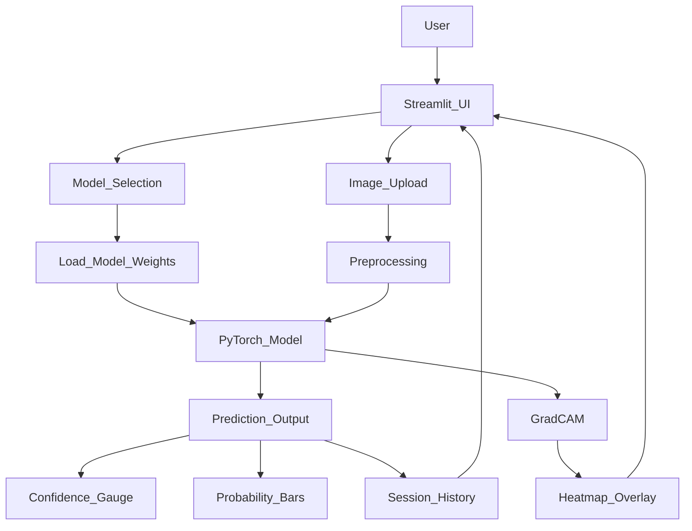
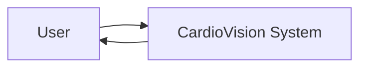
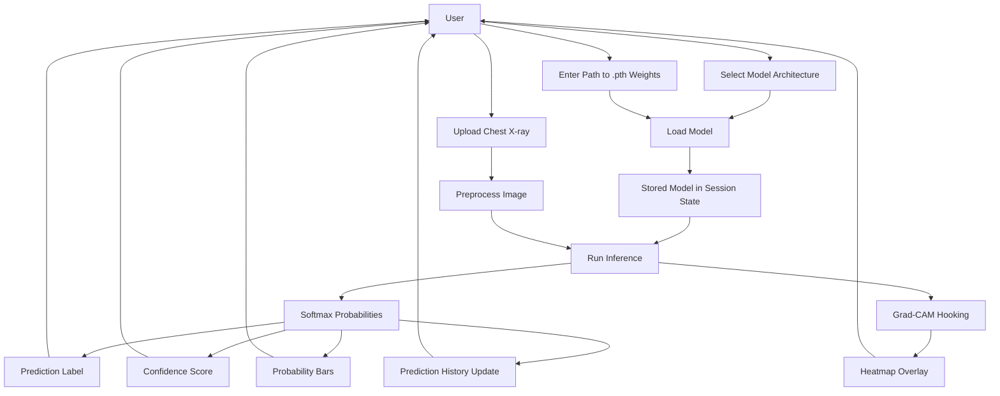
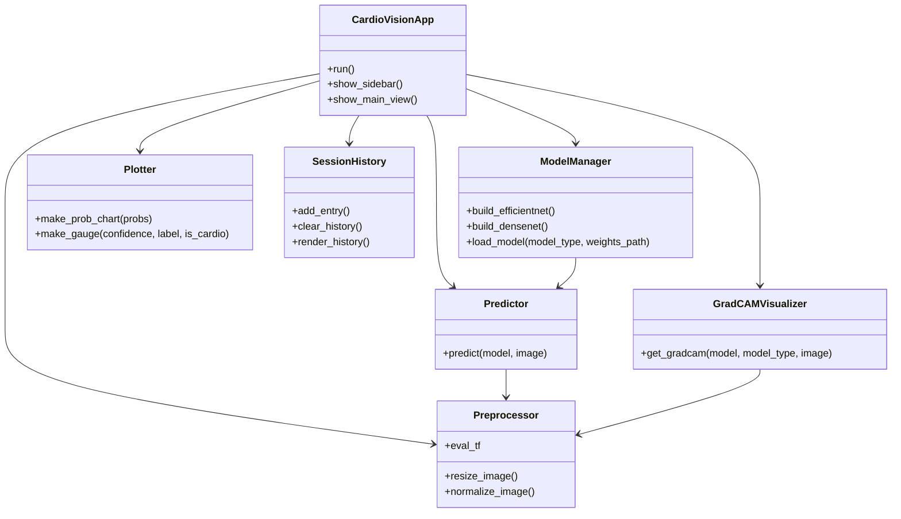
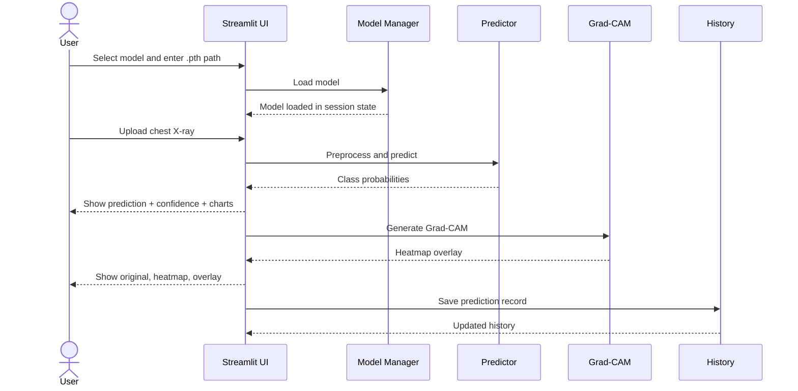

# CardioVision — Streamlit Dashboard

CardioVision is a Streamlit-based chest X-ray classification dashboard for **cardiomegaly prediction**.  
It loads locally saved PyTorch weights (`.pth`) and runs inference on a user-uploaded chest X-ray image. The dashboard supports **EfficientNet-B3** and **DenseNet-121**, shows prediction confidence, probability bars, a confidence gauge, Grad-CAM visualization, and session history. The implementation and UI flow are taken from your Streamlit app, while the medical context and methodology are aligned with the project paper. fileciteturn0file0 fileciteturn0file1

---

## 1. Project Overview

**Goal:** Detect whether a chest X-ray shows:

- `Normal`
- `Cardiomegaly`

**What the app does:**

1. Lets the user choose a model architecture.
2. Loads the selected `.pth` weight file from local storage.
3. Accepts a chest X-ray image upload.
4. Preprocesses the image to the required input format.
5. Runs deep learning inference.
6. Displays prediction, confidence, probability bars, and Grad-CAM heatmap.
7. Stores prediction details in session history.

---

## 2. Features

- Upload chest X-ray images in `PNG`, `JPG`, `JPEG`, `BMP`, or `TIFF`
- Choose between **EfficientNet-B3** and **DenseNet-121**
- Load local model weights from a full file path
- Get prediction output with confidence score
- View class probabilities as progress bars
- See confidence gauge and probability chart
- Generate Grad-CAM heatmap for explainability
- Track prediction history for the current session
- Show model status, device status, and model statistics in the sidebar

---

## 3. Technology Stack

- **Frontend/UI:** Streamlit
- **Deep Learning:** PyTorch
- **Model Backbones:** `timm` EfficientNet-B3, `torchvision` DenseNet-121
- **Image Processing:** Pillow, OpenCV, torchvision transforms
- **Visualization:** Matplotlib, Seaborn
- **Utilities:** NumPy, time, os, datetime

---

## 4. Dataset and Research Context

The project paper describes a chest X-ray dataset for cardiomegaly detection with:

- **5,552 chest X-rays**
- Balanced classes
- `true` folder = cardiomegaly
- `false` folder = normal

The paper compares **DenseNet** and **EfficientNet** for automated cardiomegaly detection and discusses preprocessing, transfer learning, model training, evaluation, and clinical relevance. The preprocessing pipeline includes resizing to **224 × 224**, normalization, and augmentation. fileciteturn0file1

---

## 5. System Architecture



### Architecture Explanation

**Presentation Layer**
- Streamlit interface
- Sidebar for model selection and loading
- File uploader for chest X-rays
- Result panels and visualization sections

**Inference Layer**
- Loads the selected model
- Applies transforms
- Produces logits and softmax probabilities
- Generates Grad-CAM

**State Layer**
- `st.session_state` keeps:
  - loaded model
  - selected architecture
  - prediction history
  - model load status

**Visualization Layer**
- Confidence gauge
- Probability bar chart
- Grad-CAM heatmap
- Prediction history table

---

## 6. Data Flow Diagram

### DFD Level 0



### DFD Level 1



### DFD Explanation

**Inputs**
- Model architecture choice
- `.pth` weight file path
- Chest X-ray image

**Processes**
- Validate model file path
- Build model architecture
- Load saved weights
- Apply preprocessing
- Predict class probabilities
- Generate explainability heatmap

**Outputs**
- Predicted label
- Confidence score
- Probability bars
- Grad-CAM visualizations
- Session history entry

---

## 7. Class Diagram

The current code is written mostly with functions, so the following diagram is a **conceptual class diagram** that maps the app into clean logical components.



### Class Responsibilities

**CardioVisionApp**
- Coordinates the complete dashboard flow
- Displays sidebar, upload section, result cards, and tabs

**ModelManager**
- Builds the selected architecture
- Loads the `.pth` state dictionary
- Moves the model to the correct device

**Preprocessor**
- Resizes the image to `224 × 224`
- Converts to grayscale with 3 channels
- Normalizes using ImageNet mean/std

**Predictor**
- Converts image into tensor
- Runs forward pass
- Applies softmax
- Returns probabilities for `Normal` and `Cardiomegaly`

**GradCAMVisualizer**
- Registers hooks on the target layer
- Captures activations and gradients
- Produces a heatmap overlay for model explainability

**Plotter**
- Draws the probability bar chart
- Draws the confidence gauge

**SessionHistory**
- Stores prediction logs for the current Streamlit session
- Supports clearing and rendering prediction history

---

## 8. File-Wise Use Case

### `app.py`

Main Streamlit application file.

**Responsibilities**
- Page configuration
- Custom CSS styling
- Constants such as `IMG_SIZE`, `CLASS_NAMES`, `MEAN`, `STD`
- Image preprocessing pipeline
- Model builders for EfficientNet-B3 and DenseNet-121
- Cached model loading
- Prediction inference
- Grad-CAM generation
- Probability chart and gauge chart rendering
- Sidebar controls
- Upload handling
- Prediction history management
- About tab content

### `requirements.txt`

Dependency list required to run the dashboard.

**Responsibilities**
- Defines all Python packages needed for the app
- Ensures reproducible environment setup

### Model weight files (`.pth`)

Examples:
- `efficientnet_b3_best.pth`
- `densenet121_best.pth`

**Responsibilities**
- Store learned neural network parameters
- Are loaded at runtime for inference only
- Must match the selected architecture

### Uploaded chest X-ray image

**Responsibilities**
- Acts as the inference input
- Is preprocessed and fed into the loaded model

### Prediction history stored in `st.session_state`

**Responsibilities**
- Keeps session-level logs of:
  - filename
  - prediction
  - confidence
  - probabilities
  - model used
  - time

### Grad-CAM output

**Responsibilities**
- Produces visual explanation of the model focus
- Helps interpret model decisions on the X-ray

---

## 9. Workflow



---

## 10. Model Details

### EfficientNet-B3
- Approx. test accuracy shown in dashboard: **~84%**
- Approx. AUC shown in dashboard: **~0.91**
- Approx. parameters: **~12M**

### DenseNet-121
- Approx. test accuracy shown in dashboard: **~80%**
- Approx. AUC shown in dashboard: **~0.88**
- Approx. parameters: **~8M**

These values are displayed in the app sidebar as model stats. The paper also discusses DenseNet and EfficientNet as the two compared architectures for cardiomegaly detection. fileciteturn0file0 fileciteturn0file1

---

## 11. Preprocessing Pipeline

The dashboard uses the following preprocessing steps:

1. Resize image to `224 × 224`
2. Convert image to grayscale with 3 output channels
3. Convert to tensor
4. Normalize using ImageNet mean and standard deviation

```python
eval_tf = T.Compose([
    T.Resize((IMG_SIZE, IMG_SIZE)),
    T.Grayscale(num_output_channels=3),
    T.ToTensor(),
    T.Normalize(mean=MEAN, std=STD)
])
```

The paper also describes resizing, normalization, and augmentation as part of the methodology. fileciteturn0file1

---

## 12. Prediction Logic

1. Load image from upload widget.
2. Apply preprocessing.
3. Run the model forward pass.
4. Apply softmax to obtain probabilities.
5. Choose the class with the highest probability.
6. Display:
   - predicted label
   - confidence
   - probability bars
   - gauge chart
   - Grad-CAM

---

## 13. Grad-CAM Explainability

The app supports Grad-CAM for model interpretability.

### What it shows
- **Warm / red regions**: high activation
- **Cool / blue regions**: low activation

### Target layers
- **EfficientNet-B3:** last convolutional block
- **DenseNet-121:** final dense layer convolution

This helps identify which regions of the chest X-ray influenced the model’s decision most.

---

## 14. How to Run

### Install dependencies

```bash
pip install -r requirements.txt
```

### Start the dashboard

```bash
streamlit run app.py
```

Open:

```text
http://localhost:8501
```

---

## 15. How to Load a Model

1. Open the sidebar
2. Select the architecture
3. Paste the full path to the `.pth` file
4. Click **Load Model**

### Example paths

**Windows**
```text
C:\Users\Aaditya\Downloads\efficientnet_b3_best.pth
```

**Linux / Mac**
```text
/home/aaditya/Downloads/efficientnet_b3_best.pth
```

---

## 16. Troubleshooting

### File not found
Make sure the full path is correct and includes `.pth`.

### Failed to load model
Ensure the selected architecture matches the saved weights.

### Grad-CAM not generating
This can happen for some model and device combinations, especially on CPU. Prediction still works.

### Slow inference on CPU
Use a CUDA-enabled NVIDIA GPU if available.

---

## 17. Disclaimer

This project is intended for **research and educational purposes only**.  
It is **not** a certified medical device and must not replace professional radiological diagnosis.

---

## 18. Reference

Research paper: **“Cardiomegaly Prediction Using Deep Learning”** by Aaditya Sharma, Akash Sharma, Abhishek Tyagi, Abhinav Gupta, and Vishakha Rohila. fileciteturn0file1

---

## 19. Suggested Repository Structure

```text
CardioVision/
├── app.py
├── requirements.txt
├── efficientnet_b3_best.pth
├── densenet121_best.pth
├── README.md
└── assets/
    └── (optional screenshots / diagrams)
```
